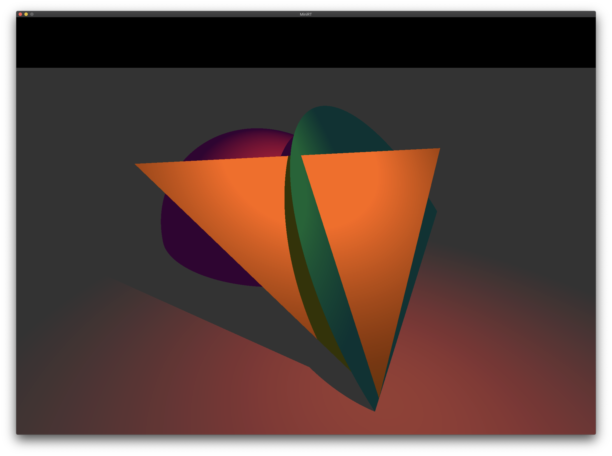

# miniRT

> :warning: **This project is a work in progress**

This project is an introduction to the beautiful world of ray-tracing.
Once completed it will be able to render simple Computer-Generated-Images.

## Index

* [Installation](#installation)
* [Usage](#usage)
  * [Definitions](#definitions)
  * [Keybindings](#keybindings)
* [Images](#images)

## Installation
Run `make` to compile the basic executable.

by using `make bonus {option}` it is possible to compile with extra options. As of yet the following options are available:
* Greyscale filter `GREY=true`

## Usage
To use the interactive interface run the executable with just a file as follows: `./minirt file.rt`.

If you wish to save an image of a scene run the command like this: `./minirt file.rt —save`. The saved image will be the rendered image from the first camera defined.

Files have to meet the following requirements:
* one definition of both resolution and ambient lighting.
* one or more definition(s) for camera(s) and light(s).
* any amount of objects.

### Definitions

Resolution:	`R {width} {height}`
* X render size.
* Y render size.

Ambient lighting:	`A {ratio} {color}`
* Ambient lighting ratio in range [0.0,1.0].
* R,G,B colors in range [0-255].

Camera:	`c {position} {orientation} {FOV}`
* X,y,z coordinates of the view point.
* A vector with the the x,y,z axis in the range [-1,1].
* Horizontal field of view in degrees in range [0,180].

Light:	`l {position} {ratio} {color}`
* X,y,z coordinates of the light point.
* The light brightness ratio in range [0.0,1.0].
* R,G,B colors in range [0-255].

Sphere:	`sp {position} {size} {color}`
* X,y,z coordinates of the sphere center.
* The sphere diameter.
* R,G,B colors in range [0-255].

Plane:	`pl {position} {orientation} {color}`
* X,y,z coordinates.
* A vector with the the x,y,z axis in the range [-1,1].
* R,G,B colors in range [0-255].

Square:	`sq {position} {orientation} {side size} {color}`
* X,y,z coordinates of the square center.
* A vector with the the x,y,z axis in the range [-1,1].
* The square size side.
* R,G,B colors in range [0-255].

Cylinder:	`cy {position} {orientation} {diameter} {height} {color}`
* X,y,z coordinates for the cylinder center.
* A vector with the the x,y,z axis in the range [-1,1].
* The cylinder diameter.
* The cylinder height.
* R,G,B colors in range [0-255].

Triangle:	`tr {first point} {second point} {third point} {color}`
* X,y,z coordinates.
* X,y,z coordinates.
* X,y,z coordinates.
* R,G,B colors in range [0-255].

Disk:	`ds {position} {orientation} {size} {color}`
* X,y,z coordinates.
* A vector with the the x,y,z axis in the range [-1,1].
* The disk diameter.
* R,G,B colors in range [0-255].

Pyramid:	`py {position} {orientation} {foundation_size} {height} {color}`
* X,y,z coordinates.
* A vector with the the x,y,z axis in the range [-1,1].
* The pyramid foundation square size.
* The pyramid height.
* R,G,B colors in range [0-255].

Example scene.rt file:
```
R   420	420
A   0.2		255,255,255

l   0,2,0 0.3 255,101,0

c   -0.8,1.5,1  0.3,-0.5,-1 70
c   0,1,0       0,0,-1      70
c   0,5,5       0,-1,-1     70

sp	0,0,-2	2   255,0,255
tr	0,0,0	1,1,-1	-1,1,-1 255,255,0
pl	0,0,0	0,1,0   255,255,255
ds	1,0,-1	1,1,1	3	0,255,255
```

### Keybindings
There are a number of useful keybindings that are listed below.

**Exiting the application.**

To exit the application press `q` or `esc`. You can also click the red `x` in the top left of the window.

**Camera**

To move the camera you can use the `WASD` keys.
To rotate the camera you can use the `↑←↓→` keys.
To switch camera's you can use the `o`(previous) and `p`(next) keys.

### Images


[More images](images/)

## License

MIT © [Victor Tennekes](https://www.github.com/victortennekes)
